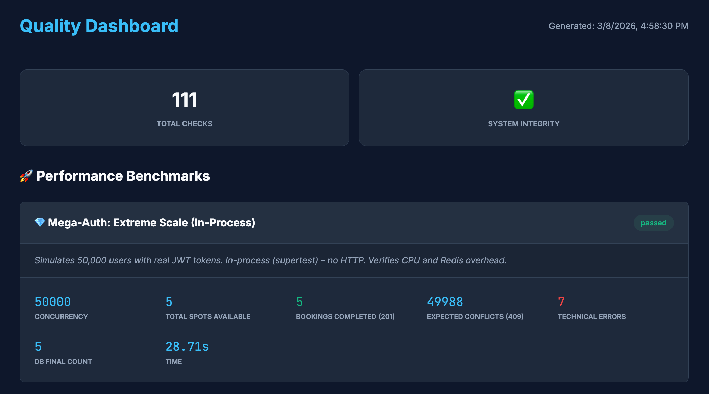
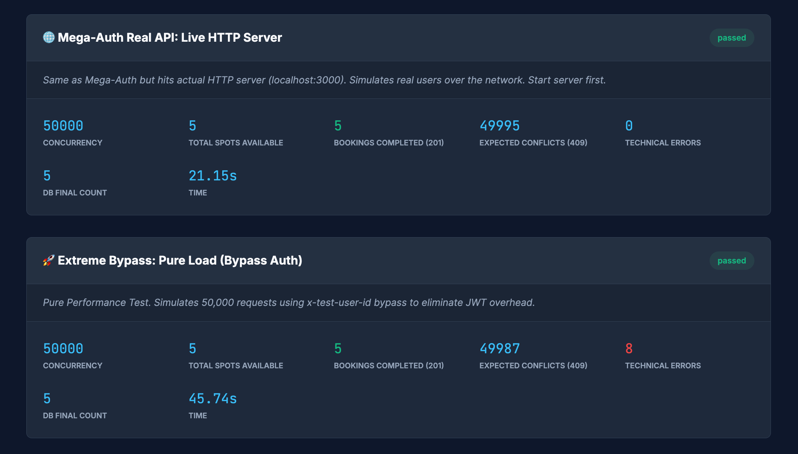
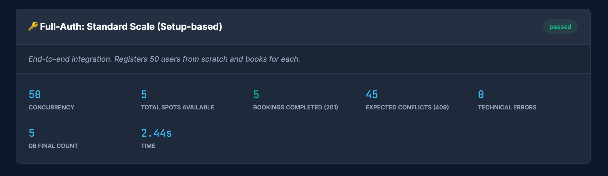

# 🎫 Eventix Backend

<p align="center">
  
  
  
  
  
</p>

<p align="center">
  High-performance event booking API built with <strong>Clean Architecture</strong> principles — layered design, Redis-backed concurrency control, and comprehensive testing (50K concurrent users, zero overbookings).
</p>

---

## 📖 Table of Contents

- [Tech Stack](#-tech-stack)
- [Architecture](#-architecture)
- [Getting Started](#-getting-started)
- [Environment Variables](#-environment-variables)
- [Available Scripts](#-available-scripts)
- [API Documentation](#-api-documentation)
- [Database](#-database)
- [Security](#-security)
- [Testing](#-testing)
- [Deployment](#-deployment)
- [Documentation Index](#-documentation-index)

---

## 🛠 Tech Stack

| Technology | Purpose |
|-----------|---------|
| **Node.js + Express** | HTTP server and routing |
| **TypeScript** | Type-safe development |
| **PostgreSQL** | Primary database (ACID transactions, `SELECT FOR UPDATE`) |
| **Redis** | High-speed booking spot cache (atomic `DECRBY` / `INCRBY`) |
| **JWT** | Stateless authentication (access + refresh tokens) |
| **Zod** | Runtime input validation |
| **Winston** | Structured logging |
| **Vitest** | Unit, integration, and API testing |
| **Helmet** | Security headers |
| **express-rate-limit** | API rate limiting |

---

## 🏗 Architecture

The backend follows a **Clean / Layered Architecture** with four distinct layers:

```
Presentation (Express)  →  Application (Services)  →  Domain (Entities/Interfaces)
                                                           ↑
                                                    Infrastructure (DB/Redis)
```

| Layer | Responsibility |
|-------|----------------|
| **Presentation** | Controllers, middlewares, routes — Express-specific |
| **Application** | Business logic, DTOs, Zod validators — framework-agnostic |
| **Domain** | Entities and repository interfaces — pure, zero dependencies |
| **Infrastructure** | PostgreSQL, Redis, repository implementations, config |

**📄 Deep Dive:** [docs/architecture.md](docs/architecture.md) — request lifecycle, middleware pipeline, folder structure

---

## 🚀 Getting Started

### Prerequisites

| Requirement | Version |
|-------------|---------|
| Node.js | ≥ 18 |
| PostgreSQL | ≥ 14 |
| Redis | ≥ 6 |

### 1. Install Dependencies

```bash
npm install
```

### 2. Configure Environment

```bash
cp .env.example .env.dev
```

Edit `.env.dev` with your local settings. A ready-to-use `.env.dev` is already included with sensible defaults:

```env
# ─── App ──────────────────────────────────────────────
NODE_ENV=dev
PORT=3000

# ─── PostgreSQL ───────────────────────────────────────
DB_HOST=localhost
DB_PORT=5432
DB_NAME=eventix
DB_USER=postgres              # ← Change to your local PG user
DB_PASSWORD=root              # ← Change to your local PG password
DB_POOL_MAX=20

# ─── Redis ────────────────────────────────────────────
REDIS_HOST=localhost
REDIS_PORT=6379
REDIS_PASSWORD=
# REDIS_URL=                  # Use for managed Redis (Render, Upstash)

# ─── Rate Limiting ────────────────────────────────────
API_RATE_LIMIT_WINDOW_MS=60000
API_RATE_LIMIT_MAX_REQUESTS=100

# ─── JWT ──────────────────────────────────────────────
JWT_SECRET=secret-key         # ← Change in production!
JWT_ACCESS_EXPIRY=1h
JWT_REFRESH_EXPIRY=7d

# ─── CORS ─────────────────────────────────────────────
CORS_ORIGINS=http://localhost:3001,http://localhost:3002,http://127.0.0.1:3001,http://127.0.0.1:3002
```

> **Files:** `.env.example` (template) → `.env.dev` (local) · `.env.test` (tests) · `.env.stg` / `.env.prod` (deployed)

### 3. Initialize Database

```bash
npm run db:init    # Creates database + runs schema (tables, types, indexes)
npm run db:seed    # Seeds admin user, regular user, and 15 events
```

### 4. Start Development Server

```bash
npm run dev        # Runs on http://localhost:3000 with hot reload
```

### Seed Data Credentials

| Role | Email | Password |
|------|-------|----------|
| Admin | `admin@eventix.com` | `Admin@123` |
| User | `user@eventix.com` | `User@123` |

> Seed includes **15 events** with statuses `draft`, `coming_soon`, and `published` (capacity 25–300).

---

## 🔧 Environment Variables

| Variable | Description | Default |
|----------|-------------|---------|
| `NODE_ENV` | Environment: `dev`, `test`, `stg`, `prod` | `dev` |
| `PORT` | Server port | `3000` |
| `DB_HOST` | PostgreSQL host | `localhost` |
| `DB_PORT` | PostgreSQL port | `5432` |
| `DB_NAME` | Database name | `eventix` |
| `DB_USER` | Database user | `postgres` |
| `DB_PASSWORD` | Database password | — |
| `DB_POOL_MAX` | Connection pool size | `20` |
| `REDIS_HOST` | Redis host | `localhost` |
| `REDIS_PORT` | Redis port | `6379` |
| `REDIS_PASSWORD` | Redis password | — |
| `REDIS_URL` | Full Redis connection URL (overrides host/port) | — |
| `JWT_SECRET` | JWT signing secret | — |
| `JWT_ACCESS_EXPIRY` | Access token expiry | `1h` |
| `JWT_REFRESH_EXPIRY` | Refresh token expiry | `7d` |
| `API_RATE_LIMIT_WINDOW_MS` | Rate limit window (ms) | `60000` |
| `API_RATE_LIMIT_MAX_REQUESTS` | Max requests per window | `100` |

> Configuration files: `.env.dev`, `.env.test`, `.env.stg`, `.env.prod`. See `.env.example` for template.

---

## 📜 Available Scripts

### Server

| Command | Description |
|---------|-------------|
| `npm run dev` | Start dev server with hot reload |
| `npm run build` | Compile TypeScript to `dist/` |
| `npm start` | Run production build |
| `npm run prod` | Run production with `NODE_ENV=prod` |

### Database

| Command | Description |
|---------|-------------|
| `npm run db:init` | Create database + run schema SQL |
| `npm run db:seed` | Seed users and events |
| `npm run db:seed:down` | Remove seed data |
| `npm run db:seed-stress` | Seed 50K users for stress tests |

### Testing

| Command | Description |
|---------|-------------|
| `npm run test:all` | All unit, integration, and API tests |
| `npm run test:unit` | Unit tests only |
| `npm run test:integration` | Integration tests only |
| `npm run test:api` | API endpoint tests only |
| `npm run test:stress-full` | 50-user full auth stress test |
| `npm run test:stress-bypass` | 50K-user bypass auth stress test |
| `npm run test:mega-auth` | 50K-user JWT stress test (in-process) |
| `npm run test:mega-auth:real` | 50K-user JWT stress test (real HTTP) |
| `npm run test:rate-limit` | Rate limiting security test |
| `npm run test:tokens` | Generate 50K JWTs for stress tests |
| `npm run test:report` | Generate HTML & Markdown test reports |

---

## 📡 API Documentation

### Endpoint Summary

| Method | Path | Auth | Description |
|--------|------|------|-------------|
| `GET` | `/api/v1/health` | Public | Health check |
| `POST` | `/api/v1/auth/register` | Public | Register user |
| `POST` | `/api/v1/auth/login` | Public | Login |
| `POST` | `/api/v1/auth/logout` | Public | Logout |
| `POST` | `/api/v1/auth/refresh` | Public | Refresh tokens |
| `GET` | `/api/v1/events` | Public / Admin | List events |
| `POST` | `/api/v1/events` | Admin | Create event |
| `GET` | `/api/v1/events/:id` | Public / Admin | Get event |
| `PATCH` | `/api/v1/events/:id` | Admin | Update event |
| `POST` | `/api/v1/events/:id/bookings` | Auth | Book tickets |
| `GET` | `/api/v1/bookings` | Auth / Admin | List bookings |
| `GET` | `/api/v1/bookings/:id` | Auth / Admin | Get booking |
| `PATCH` | `/api/v1/bookings/:id` | Auth / Admin | Cancel booking |
| `GET` | `/api/v1/audit-log` | Admin | List audit log |

**📄 Full Details:** [docs/api-reference.md](docs/api-reference.md) — request/response examples, parameters, error codes

**📄 OpenAPI Spec:** [docs/Eventix-API.openapi.json](docs/Eventix-API.openapi.json) — importable into Apidog, Swagger UI, Postman

---

## 🗄 Database

PostgreSQL with **7 tables** and **7 custom ENUM types**:

```
users ──► sessions       (1:N login sessions)
users ──► bookings       (1:N user bookings)
events ──► bookings      (1:N event bookings)
events ──► event_booking_config  (1:1 ticket limits)
events ──► event_audit_log       (operation tracking)
bookings ──► booking_audit_log   (operation tracking)
```

**📄 Deep Dive:** [docs/database-schema.md](docs/database-schema.md) — full schema, ER diagram, indexes, ENUM types

---

## 🔒 Security

| Layer | Implementation | Purpose |
|-------|----------------|---------|
| **Authentication** | JWT (access + refresh tokens) | Stateless auth with session management |
| **Authorization** | Role-based middleware (`user`, `admin`) | Endpoint-level access control |
| **Rate Limiting** | 100 req/min per IP (configurable) | Brute-force protection |
| **Input Validation** | Zod schemas on all endpoints | Prevent injection and malformed data |
| **SQL Injection** | Parameterized queries only | No string concatenation in SQL |
| **Headers** | Helmet middleware | XSS, clickjacking, MIME sniffing protection |
| **CORS** | Configurable origin whitelist | Cross-origin request control |
| **Password** | bcrypt hashing (salt rounds) | Secure password storage |

**📄 Deep Dive:** [docs/role-based-access.md](docs/role-based-access.md) — RBAC access matrix, middleware chain, future plans

---

## 🧪 Testing

Comprehensive test suite covering **111 checks** across unit, integration, API, and stress tests.

### Test Categories

| Type | Count | What It Tests |
|------|-------|---------------|
| **Unit** | Tests isolated business logic (services, validators) | Individual functions in isolation |
| **Integration** | Tests with real database | SQL queries, data integrity, transactions |
| **API** | Full HTTP end-to-end | Route → middleware → controller → service → DB |
| **Stress** | 50–50,000 concurrent users | Concurrency, overbooking prevention, throughput |

### Stress Test Results

All stress tests pass with **zero overbookings**:

<p align="center">
  
</p>

<p align="center">
  
</p>

<p align="center">
  
</p>

**📄 Full Guide:** [docs/testing-guide.md](docs/testing-guide.md) — setup, commands, workflows, common errors

---

## ☁️ Deployment

### Production (Render)

The backend is deployed on **Render** with the following services:

| Service | Type | Description |
|---------|------|-------------|
| **API** | Web Service | Node.js Express app |
| **PostgreSQL** | Managed Database | Primary data store |
| **Redis** | Managed Redis | Booking spot cache |

**Build command:** `npm run build`
**Start command:** `npm start`

Environment variables are configured via the Render dashboard using the same variables listed in [Environment Variables](#-environment-variables).

---

## 📚 Documentation Index

| Document | Description |
|----------|-------------|
| [**Architecture**](docs/architecture.md) | Layered architecture, request lifecycle, middleware pipeline |
| [**Database Schema**](docs/database-schema.md) | All tables, ER diagram, indexes, ENUM types |
| [**API Reference**](docs/api-reference.md) | All endpoints with request/response examples |
| [**Booking Flow**](docs/booking-flow.md) | Booking & cancellation lifecycle |
| [**Booking Concurrency**](docs/booking-concurrency-problem.md) | Race condition problem, Redis+PG solution, alternatives |
| [**Role-Based Access**](docs/role-based-access.md) | RBAC matrix, middleware design |
| [**Future Roadmap**](docs/future-roadmap.md) | Planned improvements and feature ideas |
| [**Testing Guide**](docs/testing-guide.md) | Test setup, commands, stress test workflows |
| [**OpenAPI Spec**](docs/Eventix-API.openapi.json) | Full OpenAPI 3.0.3 specification |

---

<p align="center">
  Made with ❤️ by <strong>Harsh Baldaniya</strong>
</p>

<p align="center">
  <a href="https://www.linkedin.com/in/hb134/">LinkedIn</a> •
  <a href="https://harshbaldaniya.com">Portfolio</a>
</p>
